
 Nathan White 

 Aron Kageza 

 Hanquing Guo 

 20180424 

 Rev 1.0 

User's Manual:
=
One of the main advantages of our implementation is that there is no necessary installation procedure for our application.  Hence, it is possible to use the application by simply browsing to its location online.  For the purpose of the in-class demonstration, a server will be availible at http://cs690s2018.dhcp.bsu.edu/#!/.

#### Using The Interface  
##### Create a New Game:
To create a new game, edit the form under "Create a Game" on the main page of the buzzwords application.  A new game can be launched just by specifying a unique game name.  Any additional game parameters you wish to change should  be modified at this point.  
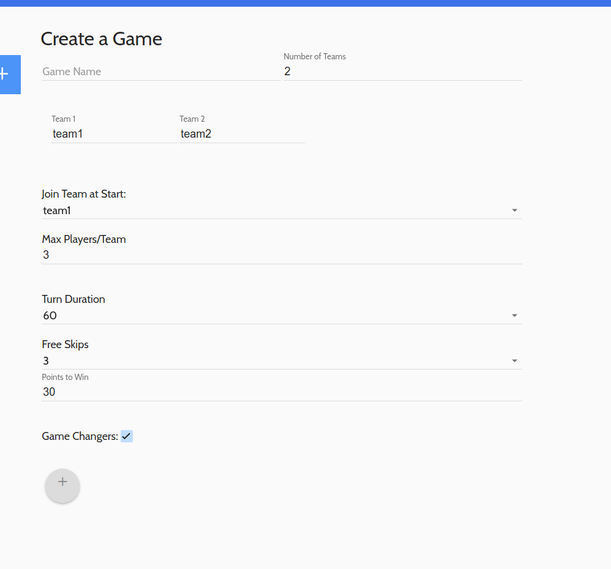</img>
##### Join an Existing Game:
To join an existing game, locate the game with the name that you wish to join under "Choose a Game".  
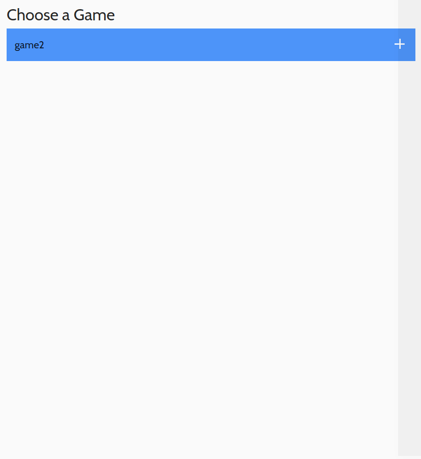</img>
Clicking the + will reveal the names of the teams and the count of players currently on each team in that game.
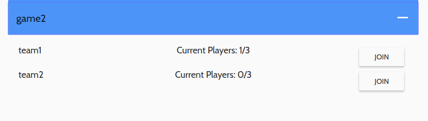</img>
Clicking the button labeled "join" next to a team which is not currently full, will cause the current player to be joined to that team.
##### Starting a Game:
The player who fills out the form under "Create a Game" will be the game initiator.  This user receives a special view with a "Start" button while waiting for players to join the game. Until a valid number of players has joined the game, the button will remain disabled.
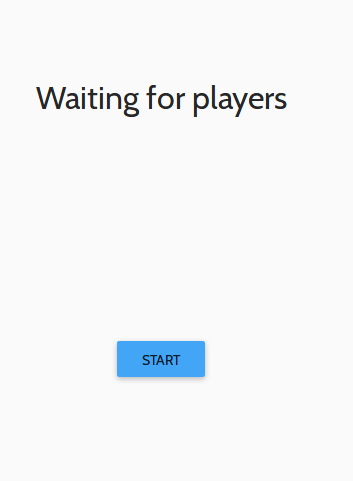</img>  
Note: this picture shows a game which has reached a full state.

All players who are not the game initiator will see the following screen:
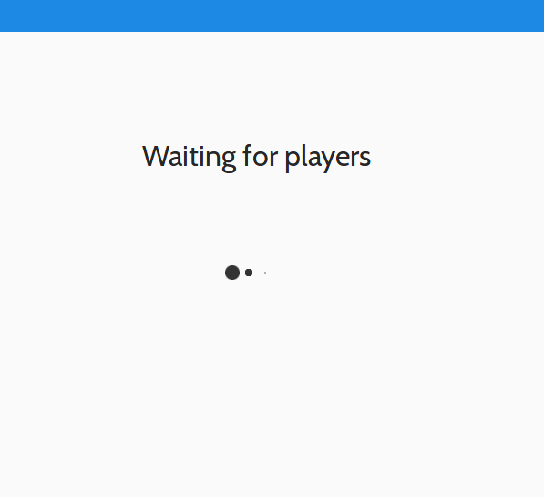</img>

Once a game has filled with players and been started, it will be removed from the main menu so that it is not visible or join-able to any new users.
##### Setting Game Changers:
At the beginning of a new turn, a teller will be selected. The teller will see their role and the wheel which will be used to determine the game changer for that turn.
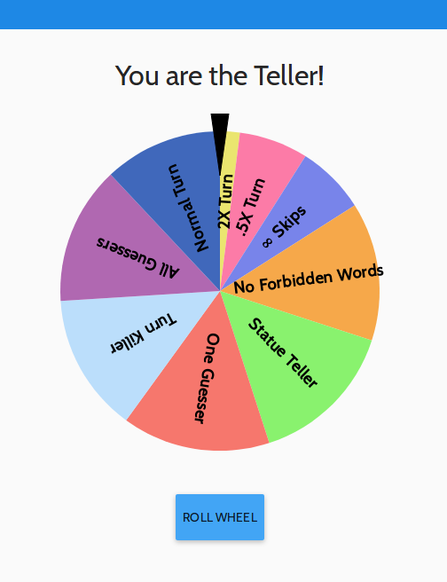</img>  
Clicking roll wheel will cause a game changer to be chosen.  The teller will be notified of the game changer and the "Start Turn" button will be displayed.
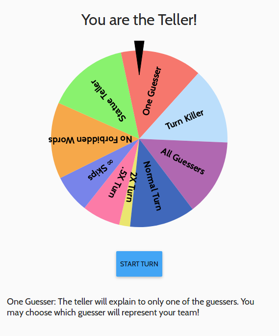</img>

##### Turn Progression:
Once the teller has clicked the "Start Turn" button, the turn will automatically start.  At this point, the timer is set and the first buzzword card is loaded in the teller's view and the moderator's views. In addition, the observers and guessers are notified of their roles, the selected game changer, and whether or not each card is a phrase or not.
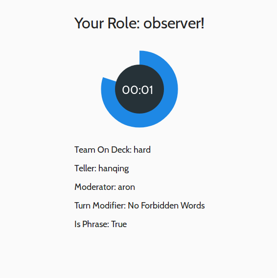</img>
During a turn, the teller and moderator will both be shown a view which is appropriate to that player.  The teller's view will show the timer, a pause/play button, and a card. The teller will also have the option to skip the current card.
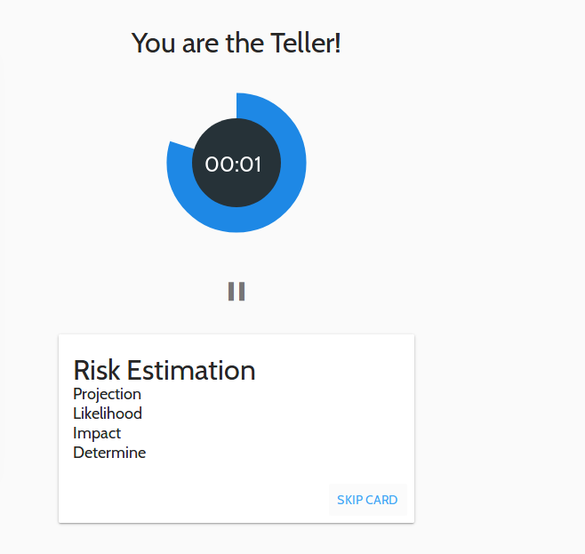</img>

The moderator will see the card and also be shown a control which allows points to be awarded or deducted from the team which is on deck.  
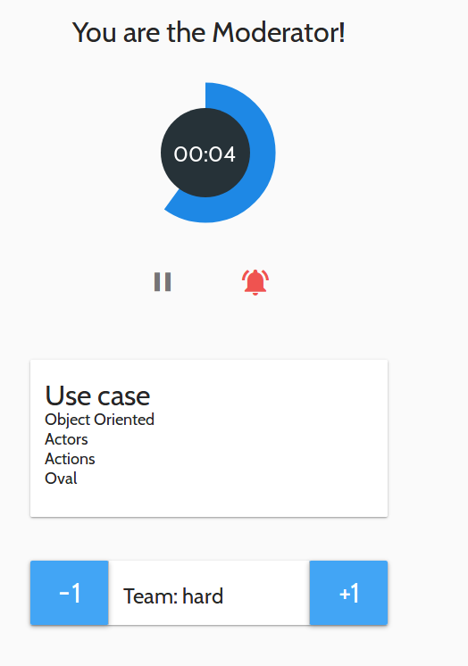</img>

At the end of a turn, a screen will display updating players to the current scores, giving a brief break between turns.
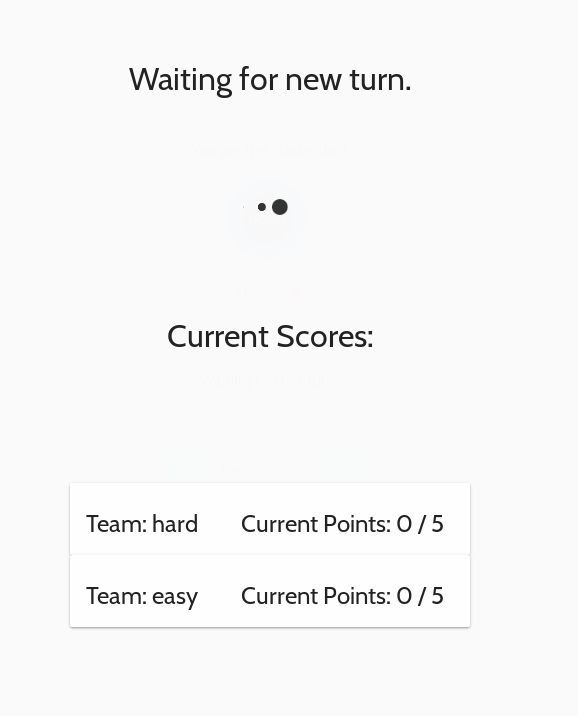</img>

#### Game Play:
Game play will roughly follow taboo rules.

##### Game Changer Selection:
1) The teller will roll the wheel to select the game changer for that turn.
2) Once the wheel has finished spinning the new game changer for the turn will be determined.  
##### Turn Play:
1) Verify that all players are familiar with the game modifier. Prepare the game players for any game modifier which is not enforced by game logic.  The teller should then star the turn by clicking "Start Turn".
2) The teller should begin to attempt to describe the buzzword at the top of the card without using any of the forbidden words listed on the card.
3) The moderator should make sure the teller obeys rule 2 and should deduct a point when it is violated. For any successful guesses, one point should be added.
4) When the timer runs out, all cards will be cleared and a new turn will begin.

#### Game Changers:
There are 9 Game changers to modify game rules for a turn.  They are as follows:
1) <b>2X Turn</b> - The time in the turn will be twice the amount set at the start of the game.
2) <b>.5X Turn</b> - The time in the turn will be half the amount set at the start of the game.
3) <b>∞ Skips</b> - The current teller may skip as many cards as they like without incurring any penalty.
4) <b>No Forbidden Words</b> - None of the forbidden words will appear on the card.
5) <b>Statue Teller</b> - The teller must stand as still as a statue while giving the clues for the buzzword.  This means that the teller must refrain from all gestures, must not show any emotion, and may only move their mouth while describing the word.
6) <b>One Guesser</b> - A single player from the team which is "on deck" will be chosen to be the guesser for that round.  The teller is only trying to get this player to guess the word.
7) <b>Turn Killer</b> - This modifier will result in a lost turn.  If a team gets this modifier that team's turn is immediately turned over to the next team.
8) <b>All Guessers</b> - All players who are not the teller or the moderator are allowed to guess. Points for a correct guess will be awarded to the team to which the correct player belongs.
9) <b>Normal Turn</b> -The turn will be a normal turn.  No game changers will be applied.
